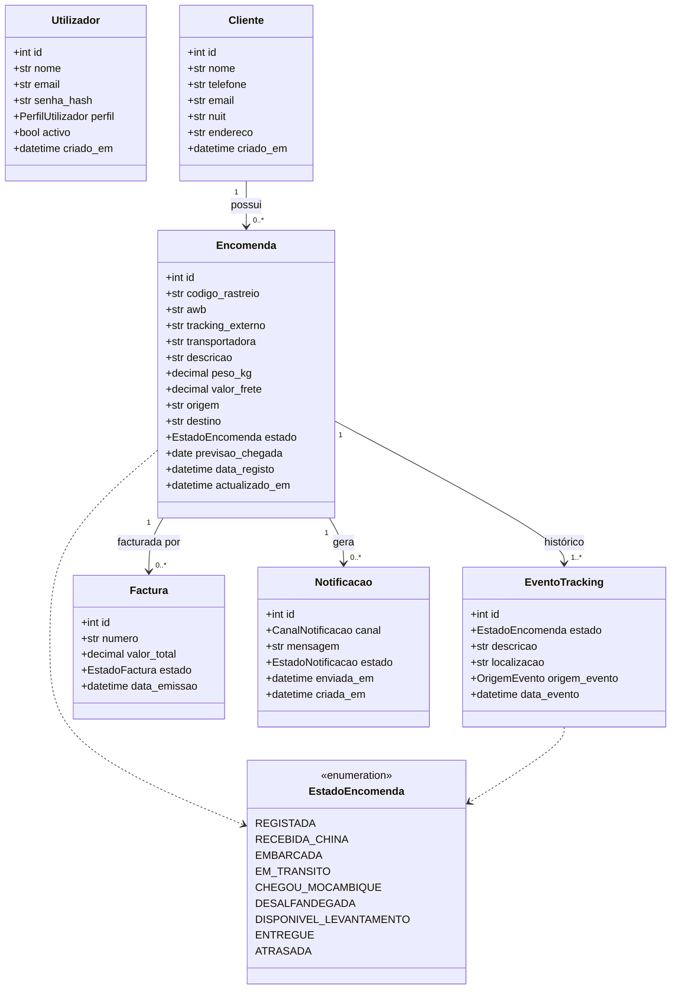

# Diagrama de Classes

Corresponde aos modelos em `backend/app/models/models.py`.

```mermaid
classDiagram
    class Utilizador {
        +int id
        +str nome
        +str email
        +str senha_hash
        +PerfilUtilizador perfil
        +bool activo
        +datetime criado_em
    }

    class Cliente {
        +int id
        +str nome
        +str telefone
        +str email
        +str nuit
        +str endereco
        +datetime criado_em
    }

    class Encomenda {
        +int id
        +str codigo_rastreio
        +str awb
        +str tracking_externo
        +str transportadora
        +str descricao
        +decimal peso_kg
        +decimal valor_frete
        +str origem
        +str destino
        +EstadoEncomenda estado
        +date previsao_chegada
        +datetime data_registo
        +datetime actualizado_em
    }

    class EventoTracking {
        +int id
        +EstadoEncomenda estado
        +str descricao
        +str localizacao
        +OrigemEvento origem_evento
        +datetime data_evento
    }

    class Factura {
        +int id
        +str numero
        +decimal valor_total
        +EstadoFactura estado
        +datetime data_emissao
    }

    class Notificacao {
        +int id
        +CanalNotificacao canal
        +str mensagem
        +EstadoNotificacao estado
        +datetime enviada_em
        +datetime criada_em
    }

    class EstadoEncomenda {
        <<enumeration>>
        REGISTADA
        RECEBIDA_CHINA
        EMBARCADA
        EM_TRANSITO
        CHEGOU_MOCAMBIQUE
        DESALFANDEGADA
        DISPONIVEL_LEVANTAMENTO
        ENTREGUE
        ATRASADA
    }

    Cliente "1" --> "0..*" Encomenda : possui
    Encomenda "1" --> "1..*" EventoTracking : histórico
    Encomenda "1" --> "0..*" Factura : facturada por
    Encomenda "1" --> "0..*" Notificacao : gera
    Encomenda ..> EstadoEncomenda
    EventoTracking ..> EstadoEncomenda
```
