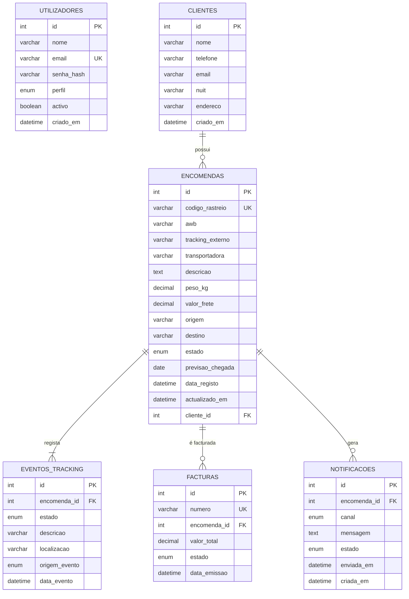

# Modelo Entidade-Relacionamento (MER)

Corresponde ao schema MySQL `gestao_importacoes` (gerado pelo SQLAlchemy).

```mermaid
erDiagram
    UTILIZADORES {
        int id PK
        varchar nome
        varchar email UK
        varchar senha_hash
        enum perfil
        boolean activo
        datetime criado_em
    }

    CLIENTES {
        int id PK
        varchar nome
        varchar telefone
        varchar email
        varchar nuit
        varchar endereco
        datetime criado_em
    }

    ENCOMENDAS {
        int id PK
        varchar codigo_rastreio UK
        varchar awb
        varchar tracking_externo
        varchar transportadora
        text descricao
        decimal peso_kg
        decimal valor_frete
        varchar origem
        varchar destino
        enum estado
        date previsao_chegada
        datetime data_registo
        datetime actualizado_em
        int cliente_id FK
    }

    EVENTOS_TRACKING {
        int id PK
        int encomenda_id FK
        enum estado
        varchar descricao
        varchar localizacao
        enum origem_evento
        datetime data_evento
    }

    FACTURAS {
        int id PK
        varchar numero UK
        int encomenda_id FK
        decimal valor_total
        enum estado
        datetime data_emissao
    }

    NOTIFICACOES {
        int id PK
        int encomenda_id FK
        enum canal
        text mensagem
        enum estado
        datetime enviada_em
        datetime criada_em
    }

    CLIENTES ||--o{ ENCOMENDAS : "possui"
    ENCOMENDAS ||--|{ EVENTOS_TRACKING : "regista"
    ENCOMENDAS ||--o{ FACTURAS : "é facturada"
    ENCOMENDAS ||--o{ NOTIFICACOES : "gera"
```
