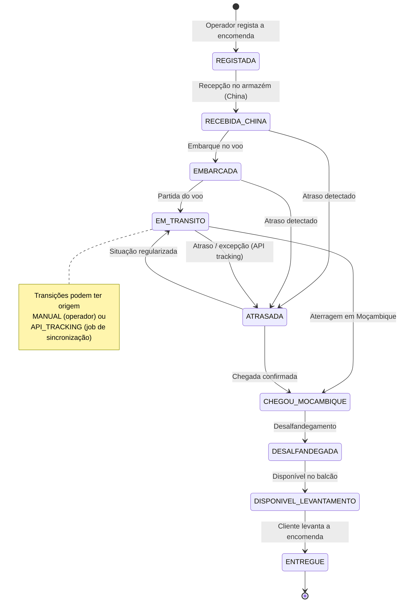

# Diagrama de Estados da Encomenda

Máquina de estados implementada em `backend/app/services/encomenda_service.py`.
Cada transição gera um evento de tracking e uma notificação ao cliente.

```mermaid
stateDiagram-v2
    [*] --> REGISTADA : Operador regista a encomenda

    REGISTADA --> RECEBIDA_CHINA : Recepção no armazém (China)
    RECEBIDA_CHINA --> EMBARCADA : Embarque no voo
    EMBARCADA --> EM_TRANSITO : Partida do voo
    EM_TRANSITO --> CHEGOU_MOCAMBIQUE : Aterragem em Moçambique
    CHEGOU_MOCAMBIQUE --> DESALFANDEGADA : Desalfandegamento
    DESALFANDEGADA --> DISPONIVEL_LEVANTAMENTO : Disponível no balcão
    DISPONIVEL_LEVANTAMENTO --> ENTREGUE : Cliente levanta a encomenda

    RECEBIDA_CHINA --> ATRASADA : Atraso detectado
    EMBARCADA --> ATRASADA : Atraso detectado
    EM_TRANSITO --> ATRASADA : Atraso / excepção (API tracking)
    ATRASADA --> EM_TRANSITO : Situação regularizada
    ATRASADA --> CHEGOU_MOCAMBIQUE : Chegada confirmada

    ENTREGUE --> [*]

    note right of EM_TRANSITO
        Transições podem ter origem
        MANUAL (operador) ou
        API_TRACKING (job de sincronização)
    end note
```
