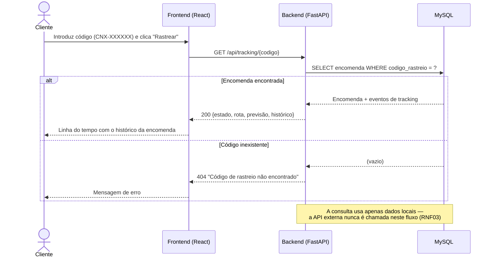

# Diagrama de Sequência — Consulta Pública de Tracking (RF09)

```mermaid
sequenceDiagram
    actor Cliente
    participant SPA as Frontend (React)
    participant API as Backend (FastAPI)
    participant BD as MySQL

    Cliente->>SPA: Introduz código (CNX-XXXXXX) e clica "Rastrear"
    SPA->>API: GET /api/tracking/{codigo}
    API->>BD: SELECT encomenda WHERE codigo_rastreio = ?
    alt Encomenda encontrada
        BD-->>API: Encomenda + eventos de tracking
        API-->>SPA: 200 {estado, rota, previsão, histórico}
        SPA-->>Cliente: Linha do tempo com o histórico da encomenda
    else Código inexistente
        BD-->>API: (vazio)
        API-->>SPA: 404 "Código de rastreio não encontrado"
        SPA-->>Cliente: Mensagem de erro
    end

    note over API,BD: A consulta usa apenas dados locais —<br/>a API externa nunca é chamada neste fluxo (RNF03)
```
