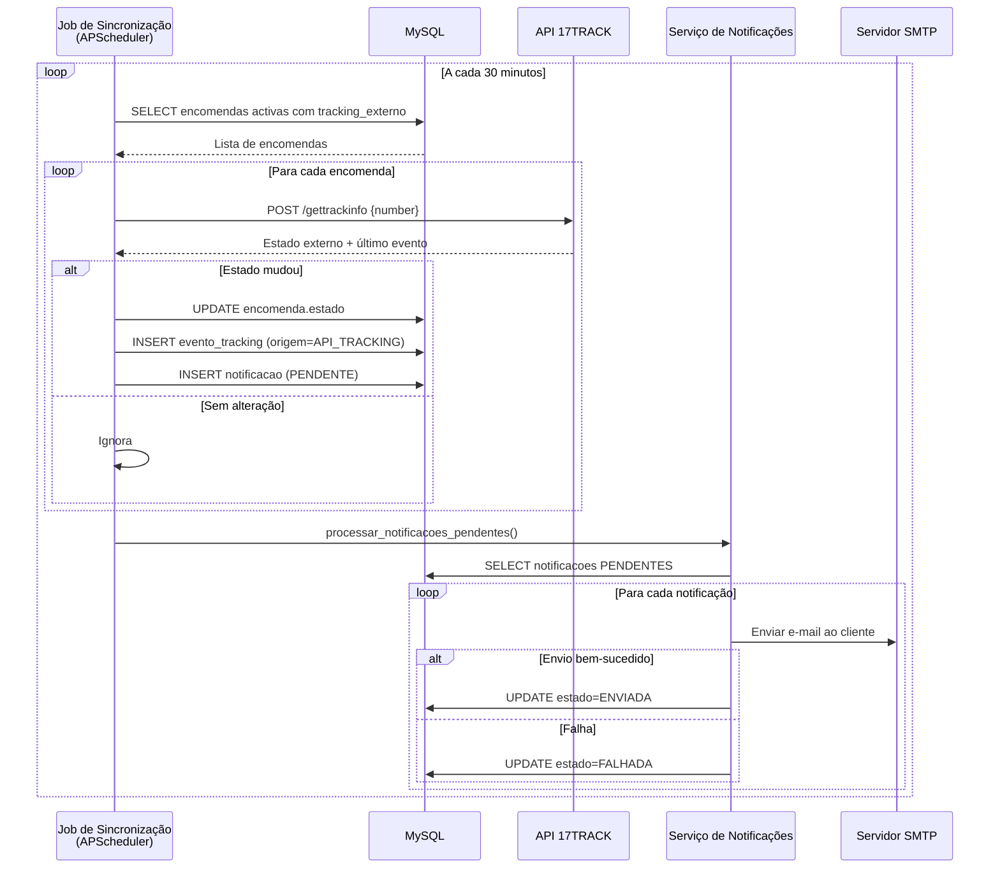

# Diagrama de Sequência — Sincronização Automática com a API de Tracking (RF08)

Implementado em `backend/app/jobs/sync_tracking.py` (APScheduler, a cada 30 min).

```mermaid
sequenceDiagram
    participant Job as Job de Sincronização<br/>(APScheduler)
    participant BD as MySQL
    participant T17 as API 17TRACK
    participant Notif as Serviço de Notificações
    participant SMTP as Servidor SMTP

    loop A cada 30 minutos
        Job->>BD: SELECT encomendas activas com tracking_externo
        BD-->>Job: Lista de encomendas

        loop Para cada encomenda
            Job->>T17: POST /gettrackinfo {number}
            T17-->>Job: Estado externo + último evento
            alt Estado mudou
                Job->>BD: UPDATE encomenda.estado
                Job->>BD: INSERT evento_tracking (origem=API_TRACKING)
                Job->>BD: INSERT notificacao (PENDENTE)
            else Sem alteração
                Job->>Job: Ignora
            end
        end

        Job->>Notif: processar_notificacoes_pendentes()
        Notif->>BD: SELECT notificacoes PENDENTES
        loop Para cada notificação
            Notif->>SMTP: Enviar e-mail ao cliente
            alt Envio bem-sucedido
                Notif->>BD: UPDATE estado=ENVIADA
            else Falha
                Notif->>BD: UPDATE estado=FALHADA
            end
        end
    end
```
